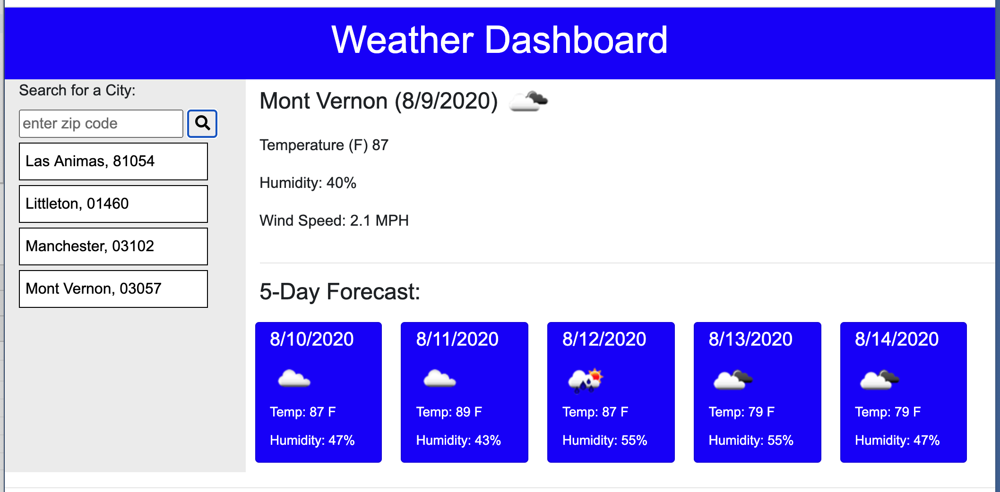

# HW6-Weather-Dashboard
unit 6 homework

Weather Dashboard:

Using the open weather API for both current weather conditions and daily forcast to get data to display on screen.
The "get weather data by zip code" call is used to get better local results. The data object returned by the zip code request contains the name of the matching city or town, and that data is extracted to display on the search history list. 
Forcast data returned provides a data object for every 3 hours, or 8 forcasts for each day. To reduce the displayed forcast to 1 per day, 7 objects are skipped for each one collected for processing. 
The weather icons are supplied by the open weather site  and the URL is built using the icon number code returned within the weather and forcast objects. 

repo url: https://github.com/macksm3/HW6-Weather-Dashboard

live site url: https://macksm3.github.io/HW6-Weather-Dashboard/

search history needs work, currently checking new search against existing so it does not add twice, want to change that so it will delete at existing position and add at last position. Also want delete button integrated into each search list item button. 
 

